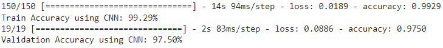

# Chest_Xray_Classification_Utilizing_CNN_with_Optimized_Hyperparameters

This study presents a deep learning algorithm developed from the ground up to categorize as well as confirm the existence of COVID in a set of X-ray imaging data. Designed a CNN architecture from the ground up to retrieve elements from provided X-ray data to categorize them and identify the individual contaminated with COVID. 

## Table of Contents

(1) **Dataset Description**

(2) **Preprocessing & Augmentation**

(3) **Proposed Architecture**

(4) **Tech/Stacks**

(5) **Result** 

(6) **Conclusion**

### Dataset Description

The following public datasets were used in this study: 

(1) _https://www.kaggle.com/datasets/tawsifurrahman/covid19-radiography-database_

(2) _https://data.mendeley.com/datasets/9xkhgts2s6_

(3) _https://www.kaggle.com/datasets/nih-chest-xrays/data_

The first Database is used to compile chest X-rays of COVID-19 positive pictures and normal images. Images of bacterial pneumonia are sourced from the second Dataset. Furthermore, photos of pneumothorax are obtained from the third Dataset. 

### Preprocessing & Augmentation

- Resized all pictures to 224 × 224 pixels,

- Used the min-max normalization method to rescale all pixel values [0, 1],

- Employed photo augmentation for solving the issue of a short dataset and to improve the accuracy rate while limiting model overfitting. 

### Proposed Architecture

  
   
    <em>Fig: Schematic Block-diagram of the Convolutional Neural Architecture</em>

### Tech/Stacks

- **Python**

- **Keras/TensorFlow**

### Results

- **Training & Validation Accuracy**

  
   
    <em>Fig: Training and Validation Accuracy</em>

- **Learning Curve**

  
   
    <em>Fig: Training and Validation Graph</em>

- **Confusion Matrix**

  
   
    <em>Fig: Connfusion Matrix</em>

- **GradCAM**

  
   
    <em>Fig: Heatmap Visualization Using GradCAM</em>

### Conclusion
Demonstrated how to use chest imaging to classify COVID and other lung-related illnesses. Developed this architecture from scratch and distinguished it from different approaches. This study will improve the health of at-risk individuals in the polluted area primarily affected by lung diseases. It will help the medical sector determine the conditions by analyzing the affected area of the chest x-ray. 

---
### Publication
**[An Empirical Model of Classifying Lung Affected Diseases to Detect COVID-19 Using Chest X-ray Employing Convolutional Neural Architecture](https://ieeexplore.ieee.org/abstract/document/9936762)**

### Author's Info
- **LinkedIn: [ovisarkar1610052](https://www.linkedin.com/in/ovisarkar1610052/)**
- **ResearchGate: [Ovi Sarkar](https://www.researchgate.net/profile/Ovi-Sarkar)**
